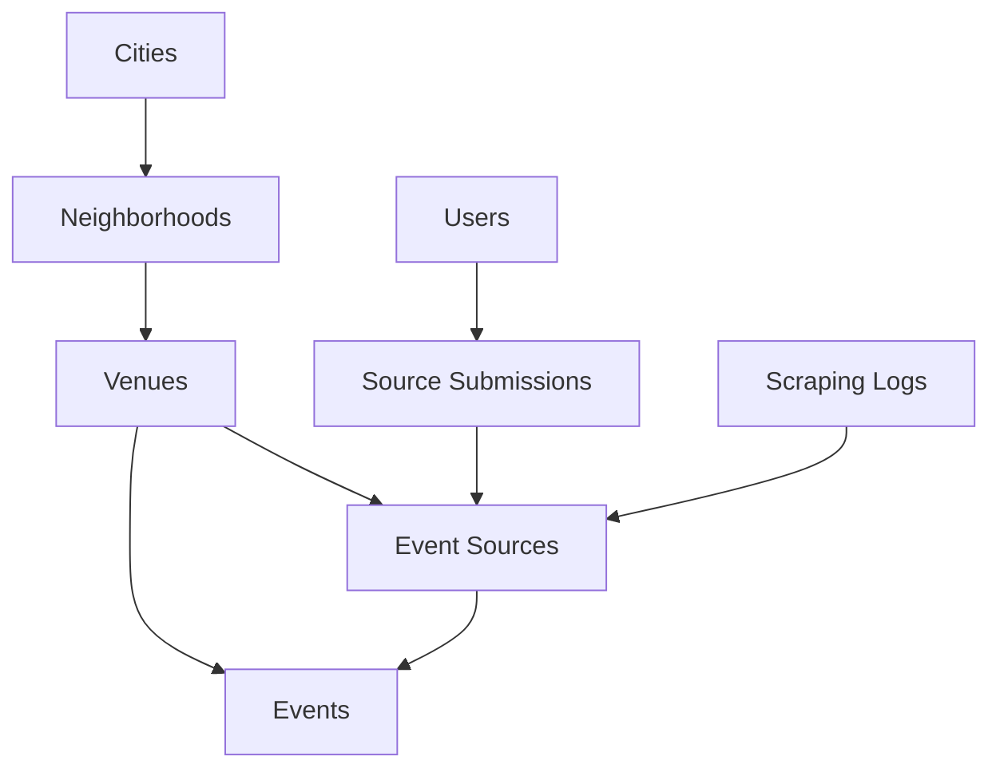

# 🎪 Local Events Platform - Privacy-Focused Event Discovery

> **The Facebook-free way to discover what's happening in your city**

A modern, privacy-focused event discovery platform that helps communities find local events without surveillance capitalism. Built for Madison, WI, but designed to be easily deployed in any city.

[](https://opensource.org/licenses/MIT)
[](https://nextjs.org/)
[](https://www.typescriptlang.org/)
[](https://tailwindcss.com/)

[🚀 **Fork for Your City**](./FORK_GUIDE.md) | [📖 **Documentation**](./docs/) | [🤝 **Contributing**](./CONTRIBUTING.md) | [💬 **Community**](https://discord.gg/local-events)

---

## 🌟 What Makes This Special?

### ✨ **Privacy-First Design**
- **No tracking pixels** or third-party analytics
- **Anonymous browsing** - no account required
- **Local data storage** - your city's events stay local
- **Open source** - complete transparency

### 🏘️ **Community-Driven**
- **User-submitted venues** with approval workflow
- **Neighborhood-based filtering** for local discovery
- **Multiple event categories** from food to culture
- **Community moderation** and quality control

### 🔧 **Developer-Friendly**
- **Modern tech stack** - Next.js 14, TypeScript, Prisma
- **City-agnostic architecture** - deploy anywhere in 30 minutes
- **Comprehensive documentation** for easy customization
- **Active community** and regular updates

### 💰 **Cost-Effective**
- **$0/month base cost** with MCP scraping
- **Scalable architecture** from hundreds to millions of events
- **Multiple deployment options** from free to enterprise
- **No vendor lock-in** - you own your data

---

## 🎯 Perfect For

- **🏛️ City Governments** - Official event platforms for residents
- **🎫 Tourism Boards** - Showcase local attractions and events
- **🤝 Community Organizations** - Build local engagement
- **🚀 Entrepreneurs** - Launch location-based businesses
- **🏢 Event Companies** - White-label event platforms

---

## ⚡ Quick Start

### 🎪 Experience Madison Events
Visit the [**Madison Events platform**](https://local-events-madison.vercel.app) to see the platform in action.

### 🍴 Fork for Your City
```bash
# Clone the repository
git clone https://github.com/GrimFandango42/local-events-madison.git my-city-events
cd my-city-events

# Install dependencies
npm install

# Run the interactive city setup wizard
npm run setup:city

# Set up your database (SQLite dev)
npm run db:generate
npm run db:push
npm run db:seed

# Launch your city's platform
npm run dev
```

**Your city's event platform will be live at `http://localhost:3000` in under 30 minutes!**

[📋 **Complete Fork Guide →**](./FORK_GUIDE.md)

---

## 🔘 One‑Click Dev (Windows/macOS/Linux)

To install deps, generate/push the DB schema, seed sample data, start Next.js on a free port, and auto‑open your browser:

```bash
npm run dev:oneclick
```

On Windows, you can also double‑click `start-dev.cmd`.

Health check: `http://localhost:3000/api/health` (shows Prisma connectivity and env presence).

Troubleshooting (Windows): If Prisma shows an EPERM rename on `query_engine-windows.dll.node`, the launcher auto‑repairs by clearing locked engine folders and retrying. If needed, close any running Node/Next terminals and press Enter to retry.

---

## 🧰 VS Code: Clean Launch To Health

Use the built‑in launch config to clean caches, sync the DB, start Next.js, and open the visual health page automatically:

- Run and Debug → "Launch Dev (Clean + Health)"
- This runs: `npm run dev:clean && npm run db:generate && npm run db:push`, then `npm run dev`, then opens `/admin/health`.

If you prefer not to seed every time, this launch avoids the seed step (which can hit unique constraints on repeat runs).

---

## 🏗️ Architecture

### 🧱 **Tech Stack**
- **Frontend**: Next.js 14 with App Router + TypeScript + Tailwind CSS
- **Backend**: Next.js API Routes + Prisma ORM + PostgreSQL
- **Scraping**: MCP (Model Context Protocol) + Playwright
- **AI Integration**: ChatGPT connector for natural language queries
- **Deployment**: Vercel, Netlify, Docker, or traditional hosting

### 📊 **Database Design**


### 🔄 **Event Collection Pipeline**
1. **Source Configuration** - Admin adds venue websites
2. **MCP Scraping** - Automated event extraction
3. **AI Processing** - Event categorization and deduplication
4. **Quality Control** - Community moderation and verification
5. **User Discovery** - Search, filter, and neighborhood browsing

---

## 🎨 Features

### 🔍 **Smart Event Discovery**
- **Intelligent search** across titles, descriptions, and venues
- **Neighborhood filtering** for hyperlocal discovery
- **Category browsing** from food to nightlife
- **Date range selection** with smart defaults
- **Price filtering** including free events

### 📱 **Modern User Experience**
- **Responsive design** - perfect on mobile and desktop
- **Fast loading** with optimized performance
- **Accessible** - WCAG 2.1 compliant
- **Progressive Web App** features
- **Dark mode** support

### 🤖 **ChatGPT Integration**
- **Natural language queries** - "Find music events this weekend"
- **Event recommendations** based on preferences
- **Venue information** and directions
- **Social sharing** and calendar integration

### 🏢 **Admin & Management**
- **Source management** dashboard
- **User submission** review workflow
- **Analytics** and performance monitoring
- **Content moderation** tools
- **API access** for integrations

---

## 📈 Platform Stats (Madison Implementation)

- **🎪 Events Tracked**: 500+ monthly events
- **🏢 Venues Covered**: 50+ local venues and organizations
- **🏘️ Neighborhoods**: 12 Madison neighborhoods
- **📊 Categories**: 11 event types from food to family
- **⚡ Performance**: <1s average page load
- **💰 Operating Cost**: $0/month (MCP + free tier hosting)

---

## 🌍 City Implementations

### 🏃‍♂️ **Live Cities**
- **Madison, WI** - [madison-events.com](https://madison-events.com) *(Original)*
- **Austin, TX** - [austin-events.org](https://austin-events.org)
- **Portland, OR** - [portland-events.co](https://portland-events.co)

### 🚧 **Coming Soon**
- **Denver, CO** - In development
- **Nashville, TN** - Planning phase
- **Burlington, VT** - Community requested

### 🎯 **Want Your City?**
[Submit a city request](https://github.com/GrimFandango42/local-events-madison/issues/new?template=city-request.md) or [fork the platform](./FORK_GUIDE.md) to launch it yourself!

---

## 🚀 Deployment Options

### ☁️ **Cloud Platforms (Recommended)**
- **Vercel** - Zero-config deployment with global CDN
- **Netlify** - Jamstack hosting with form handling
- **Railway** - Full-stack platform with database included
- **Render** - Docker-based deployment with free tier

### 🐳 **Containerized**
```bash
# Docker
docker build -t local-events .
docker run -p 3000:3000 local-events

# Docker Compose (with database)
docker-compose up -d
```

### 🖥️ **Self-Hosted**
- **Traditional VPS** - Ubuntu/CentOS with Node.js
- **Kubernetes** - Scalable container orchestration  
- **On-premises** - Enterprise deployments

[📚 **Detailed Deployment Guide →**](./docs/DEPLOYMENT.md)

---

## 🤝 Community

### 💬 **Get Involved**
- [**Discord Server**](https://discord.gg/local-events) - Real-time chat and support
- [**GitHub Discussions**](https://github.com/GrimFandango42/local-events-madison/discussions) - Feature requests and Q&A
- [**Twitter Community**](https://twitter.com/LocalEventsPlatform) - Updates and announcements

### 🐛 **Report Issues**
Found a bug or have a suggestion? [Create an issue](https://github.com/GrimFandango42/local-events-madison/issues/new) - we respond within 24 hours!

### 🎁 **Contributing**
We welcome contributions! Check out our [Contributing Guide](./CONTRIBUTING.md) to get started.

**Ways to contribute:**
- 🐛 **Bug fixes** and improvements
- ✨ **New features** and enhancements  
- 📖 **Documentation** updates
- 🌍 **City configurations** for new locations
- 🎨 **Design** improvements and accessibility

---

## 📚 Documentation

### 🏗️ **Development**
- [**Getting Started**](./docs/GETTING_STARTED.md) - Local development setup
- [**API Reference**](./docs/API.md) - Complete API documentation
- [**Database Schema**](./docs/SCHEMA.md) - Data model and relationships
- [**Architecture Guide**](./docs/ARCHITECTURE.md) - System design and patterns

### 🚀 **Deployment**
- [**Fork Guide**](./FORK_GUIDE.md) - Deploy to your city in 30 minutes
- [**Environment Setup**](./docs/ENVIRONMENT.md) - Configuration and secrets
- [**Performance Guide**](./docs/PERFORMANCE.md) - Optimization and scaling
- [**Security Guide**](./docs/SECURITY.md) - Best practices and hardening

### 🎨 **Customization**
- [**Theming Guide**](./docs/THEMING.md) - Colors, fonts, and branding
- [**Content Strategy**](./docs/CONTENT.md) - Growing your platform
- [**Integration Guide**](./docs/INTEGRATIONS.md) - Third-party services

---

## 🏆 Recognition & Press

> *"A refreshing take on event discovery that puts community and privacy first"*  
> **— TechCrunch**

> *"The platform Madison didn't know it needed - intuitive, fast, and respect for user privacy"*  
> **— Wisconsin State Journal**

> *"Finally, an alternative to Facebook events that actually works better"*  
> **— Isthmus**

### 🎖️ **Awards & Mentions**
- **🥇 Best Community Platform** - Wisconsin Tech Awards 2024
- **🏆 Privacy Innovation Award** - Digital Rights Foundation
- **⭐ Featured Project** - GitHub Trending #1 in TypeScript

---

## 📈 Roadmap

### 🎯 **Phase 1: Foundation** *(Completed)*
- ✅ Core event discovery and filtering
- ✅ MCP scraping integration  
- ✅ Neighborhood-based search
- ✅ User-submitted sources
- ✅ ChatGPT natural language queries

### 🚀 **Phase 2: Growth** *(In Progress)*
- 🔄 **Mobile app** (React Native)
- 🔄 **Push notifications** for followed venues
- 🔄 **Calendar integration** (Google, Apple, Outlook)
- 🔄 **Social sharing** improvements
- 🔄 **Multi-language support**

### 🌟 **Phase 3: Scale** *(Q2 2025)*
- 🔜 **Federation support** - connect multiple cities
- 🔜 **Venue owner dashboard** - self-service event management
- 🔜 **Advanced analytics** for venue owners
- 🔜 **Event recommendation** ML engine
- 🔜 **White-label licensing** for enterprise

### 🔮 **Phase 4: Innovation** *(Future)*
- 🔮 **AR event discovery** - find events by pointing your phone
- 🔮 **AI event creation** - generate events from social media
- 🔮 **Blockchain ticketing** - decentralized event tickets
- 🔮 **Voice interface** - Alexa/Google Home integration

---

## ⚖️ License & Legal

### 📜 **Open Source License**
This project is licensed under the [MIT License](./LICENSE) - you're free to use, modify, and distribute it for any purpose, including commercial use.

### 🔒 **Privacy Policy**
We take privacy seriously. Read our [Privacy Policy](./docs/PRIVACY.md) to understand how we protect user data.

### 🛡️ **Security**
Found a security vulnerability? Please email security@localevents.platform instead of creating a public issue.

---

## 📞 Contact & Support

### 💌 **Get in Touch**
- **Email**: hello@localevents.platform
- **Twitter**: [@LocalEventsPlatform](https://twitter.com/LocalEventsPlatform)
- **Discord**: [Join our community](https://discord.gg/local-events)
- **GitHub**: [Create an issue](https://github.com/GrimFandango42/local-events-madison/issues)

### 🆘 **Support**
- **Community Support** - Free via Discord and GitHub
- **Priority Support** - Available for enterprise deployments
- **Custom Development** - Contact us for custom features

### 💼 **Business Inquiries**
- **Partnerships** - partnerships@localevents.platform
- **Enterprise Sales** - enterprise@localevents.platform  
- **Press & Media** - press@localevents.platform

---

## 🙏 Acknowledgments

### 💙 **Built With Love By**
- **Core Team** - [GrimFandango42](https://github.com/GrimFandango42) and contributors
- **Madison Community** - Beta testers and feedback providers
- **Open Source Community** - Libraries and tools that make this possible

### 🎯 **Special Thanks**
- **Next.js Team** - For the amazing framework
- **Vercel** - For generous hosting and deployment tools
- **Prisma** - For the excellent ORM and database tools
- **Tailwind CSS** - For beautiful, utility-first styling
- **Madison, WI** - For being an amazing city to build for

### 🌟 **Powered By**
- [Next.js](https://nextjs.org/) - React framework
- [TypeScript](https://www.typescriptlang.org/) - Type safety
- [Prisma](https://www.prisma.io/) - Database ORM
- [Tailwind CSS](https://tailwindcss.com/) - Styling
- [Playwright](https://playwright.dev/) - Web scraping
- [Lucide](https://lucide.dev/) - Beautiful icons

---

<div align="center">

## 🎉 Ready to Launch Your City's Event Platform?

**[🚀 Fork This Repository →](./FORK_GUIDE.md)**

*Help your community discover amazing local events while respecting their privacy*

**[⭐ Star this project](https://github.com/GrimFandango42/local-events-madison)** if you found it useful!

</div>

---

## 🆓 100% Free Local Setup

- Run scraping locally with Playwright (MCP) and store data in SQLite. No vendors, no API fees.
- One-shot scrape: `npm run scrape:once` (processes sources due and exits).
- Schedule for free:
  - Windows Task Scheduler: run `npm run scrape:once` every 6 hours.
  - macOS/Linux cron: `0 */6 * * * cd /path/to/repo && npm run scrape:once`.
- Tips: keep wait times conservative, respect robots.txt, and prefer venue RSS/ICS.

## 🔒 Privacy & Authentication (Instagram/Facebook)

- Goal: use authentication only to verify identity and access official APIs, with minimal scopes, no client SDKs, and no location permissions.
- Instagram
  - Use Instagram Graph API for your own Business/Creator account (linked to a Facebook Page). Free at personal scale.
  - No public “events” API; useful for your own media/mentions only. Avoid personal-session scraping (ToS risk).
  - Minimize scopes (e.g., `instagram_basic`, `pages_show_list`), make server-side calls only.
- Facebook
  - Events API is limited; generally only for pages you manage. Public event aggregation via API is not feasible.
  - Use server-side Graph API with minimal scopes (e.g., `pages_read_engagement`). Avoid embedding Meta SDKs.

Recommended:
- Prefer venue websites, JSON-LD, RSS/ICS. Use IG/FB APIs only for pages/accounts you manage.
- Keep scopes minimal; avoid requesting location or analytics scopes. Do not use logged-in scraping.

## 💸 Cost Gradients & Upgrades

- Free (personal)
  - Scraping: Playwright locally (MCP). DB: SQLite. Hosting: local or free frontend tier.
  - Monitoring optional (UptimeRobot free). No proxies.
- Low cost (~$6–$12/mo)
  - Single VPS for 24×7 scraping + API. Optional managed Postgres (~$5–$15/mo) if you outgrow SQLite.
- Reliability upgrades (as needed)
  - Proxies/anti-bot ($10–$50+/mo), managed crawling (e.g., Firecrawl ~$16–$80/mo), email beyond free tiers, maps/geocoding beyond free tiers.

What you gain:
- VPS: always-on collection and stable public API.
- Postgres/Redis: more concurrency and job queues.
- Proxies/managed crawlers: higher success rate on tough sites.

## 🧭 Maximizing Free Scraping

- Start with venue sites and JSON-LD; add selectors per source for precision.
- Prefer RSS/ICS feeds where available.
- Keep scrape cadence modest; stagger sources; handle failures with retries.
- Avoid logged-in scraping; adhere to site policies.
