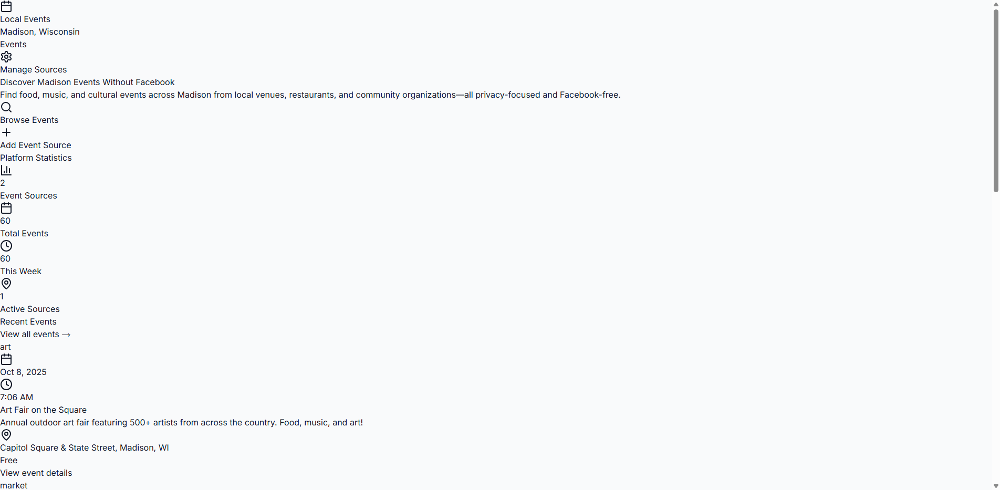

# Local Events Platform

A web application for aggregating and discovering local events. Currently configured for Madison, WI but can be adapted for other cities.

[](https://opensource.org/licenses/MIT)
[](https://nextjs.org/)
[](https://www.typescriptlang.org/)
[](https://tailwindcss.com/)

## Screenshot


*Event aggregation interface showing Madison events*

## Features

- Event aggregation from multiple sources
- Neighborhood-based filtering
- Event categorization (food, music, culture, etc.)
- User-submitted venues and sources
- No user accounts required
- SQLite database with optional PostgreSQL support

## Tech Stack

- **Frontend**: Next.js 14, TypeScript, Tailwind CSS
- **Backend**: Next.js API Routes, Prisma ORM
- **Database**: SQLite (default) or PostgreSQL
- **Scraping**: Playwright, MCP (Model Context Protocol)
- **Testing**: Vitest (unit), Playwright (E2E), Jest (integration)

## Quick Setup

```bash
# Clone the repository
git clone [repository-url] local-events
cd local-events

# Install dependencies
npm install

# Set up environment variables
cp .env.example .env.local
# Edit .env.local with your configuration

# Set up database
npm run db:generate
npm run db:push
npm run db:seed

# Start development server
npm run dev
```

The application will be available at `http://localhost:3000`.

## One‑Click Production Launch (Windows)

- Double‑click `start-prod-health.cmd`
  - Installs dependencies (ci if lock present)
  - Runs `prisma generate` and `db push`
  - Seeds sample data
  - Builds the app and starts `next start` on port 3010
  - Opens `http://localhost:3010/admin/health`

## One-Click Development

For automated setup:

```bash
npm run dev:oneclick
```

This command will:
1. Install dependencies
2. Generate and push database schema
3. Seed sample data
4. Start development server
5. Open browser to health check

Health check endpoint: `http://localhost:3000/api/health`

## Automated Health Check (Playwright)

After `next start` run:

```bash
BASE_URL=http://localhost:3010 node scripts/e2e-health-check.js
```

- Captures a screenshot at `tests/outputs/health-page.png`
- Prints browser console errors (helpful for CSP/hydration issues)

## CSP & Security

- We ship sane defaults in `next.config.js` so pages render reliably:
  - `script-src` allows `'unsafe-inline'` and `blob:` (Next.js hydration inline scripts)
  - Dev also allows `ws:` for HMR
  - `worker-src 'self' blob:` for web workers
- Want stricter CSP? We can switch to nonces/hashes and remove `'unsafe-inline'`.

## City Config

- City theming/data in `config/madison.json`
- Load via `loadCityConfig()` from `lib/city-config.ts`

## Linting

- ESLint is configured in `.eslintrc.cjs`. Builds skip lint to keep shipping fast.
- Run `npm run lint` locally; we can fix the codebase in batches.

## Available Scripts

- `npm run dev` - Start development server
- `npm run build` - Build production application
- `npm run start` - Start production server
- `npm run lint` - Run ESLint
- `npm run typecheck` - Run TypeScript compiler check
- `npm run test:unit` - Run Vitest unit tests
- `npm run test:e2e` - Run Playwright E2E tests
- `npm run test` - Run Jest integration tests
- `npm run db:generate` - Generate Prisma client
- `npm run db:push` - Push database schema
- `npm run db:seed` - Seed database with sample data
- `npm run scrape:once` - Run single scraping session

## Database Setup

The application uses SQLite by default. To use PostgreSQL:

1. Update `DATABASE_URL` in `.env.local`
2. Run `npm run db:push` to apply schema
3. Run `npm run db:seed` for sample data

## Environment Variables

Required variables (copy from `.env.example`):
- `DATABASE_URL` - Database connection string
- `NEXTAUTH_SECRET` - Authentication secret
- `NEXTAUTH_URL` - Application URL

Optional:
- `REDIS_URL` - Redis cache connection
- `FIRECRAWL_API_KEY` - Firecrawl service key

## Architecture

### Database Schema
- **Cities** - Location data
- **Neighborhoods** - City subdivisions
- **Venues** - Event locations
- **Events** - Event data
- **EventSources** - Scraping sources
- **ScrapingLogs** - Collection history

### Event Collection
1. Configure sources in admin panel
2. Run scraping via MCP/Playwright
3. Process and deduplicate events
4. Display to users with filtering

## Deployment

### Vercel (Recommended)
1. Connect GitHub repository
2. Set environment variables
3. Deploy automatically on push

### Docker
```bash
docker build -t local-events .
docker run -p 3000:3000 local-events
```

### Traditional Hosting
1. Build application: `npm run build`
2. Copy `.next` folder to server
3. Install production dependencies
4. Start with `npm start`

## Scraping Configuration

### Local Scraping (Free)
- Uses Playwright with MCP for local event collection
- SQLite database storage (no external dependencies)
- Manual trigger: `npm run scrape:once`
- Scheduled automation:
  - Windows: Task Scheduler
  - Linux/macOS: cron jobs

### Source Management
- Add venue websites through admin interface
- Configure scraping selectors for each source
- Prefer structured data (JSON-LD, RSS, iCal) when available
- Respect robots.txt and rate limits

### Social Media Integration
- Facebook Events API has limited public access
- Instagram Graph API only for owned business accounts
- Recommend focusing on venue websites and official sources

## Troubleshooting

### Windows EPERM Error
If Prisma shows permission errors on Windows:
1. Close all Node.js/Next.js processes
2. Delete `node_modules/.prisma` folder
3. Run `npm run db:generate`

### Database Issues
- Ensure SQLite file permissions are correct
- For PostgreSQL, verify connection string format
- Check database exists and is accessible

### Development Server
- Default port is 3000, auto-finds free port if occupied
- Health endpoint at `/api/health` shows database connectivity
- Check console for detailed error messages

## License

MIT License - see LICENSE file for details.