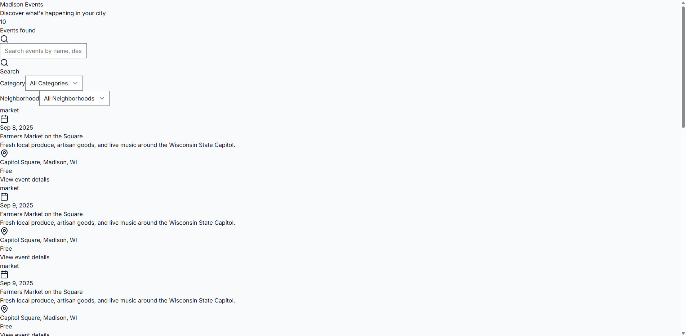
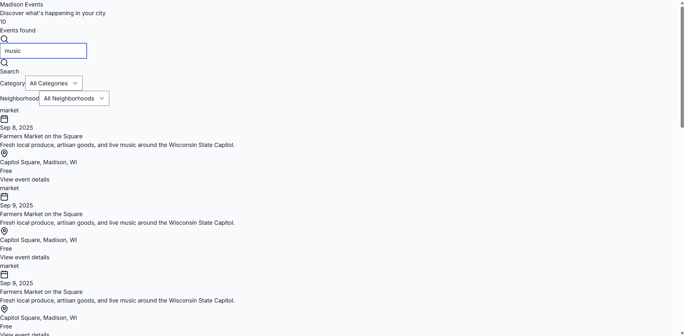

# 🎭 Local Events Madison
*Facebook-free event discovery for Wisconsin's capital*

[](https://opensource.org/licenses/MIT)
[](https://nextjs.org/)
[](https://www.typescriptlang.org/)
[](https://tailwindcss.com/)

A privacy-focused web application for discovering cultural events, live music, and community gatherings in Madison, Wisconsin. No social media tracking, no user accounts required—just pure local event discovery.

---

## 🌟 What Users See

### Main Event Discovery

*Clean interface displaying local cultural events, concerts, and community gatherings*

### Smart Search & Filtering
<div align="center">


</div>

*Powerful filtering by category, neighborhood, and keywords to find exactly what you're looking for*

### Rich Event Details

*Each event shows comprehensive details: venue, timing, pricing, and descriptions*

---

## ✨ Features

🎵 **Music & Cultural Events** - Jazz at Memorial Union, Symphony performances, Art Fairs  
🏘️ **Neighborhood Filtering** - Downtown, Capitol, University, and more  
🔍 **Smart Search** - Find events by keyword, category, or venue  
🚫 **No Social Media** - Privacy-first design with zero Facebook dependencies  
📱 **Mobile Friendly** - Responsive design for all devices  
⚡ **Lightning Fast** - Local SQLite database with optional PostgreSQL  

---

## 🚀 Quick Setup

Get your Madison events platform running in under 3 minutes:

```bash
# Clone and setup
git clone [repository-url] local-events-madison
cd local-events-madison

# One-command setup
npm run dev:oneclick
```

This automatically:
- ✅ Installs all dependencies
- ✅ Sets up the database
- ✅ Seeds with Madison event data
- ✅ Starts the development server
- ✅ Opens health check in browser

**Ready at:** `http://localhost:3000`

---

## 🛠️ Tech Stack

**Frontend Excellence**
- **Next.js 14** - React framework with App Router
- **TypeScript** - Strict typing throughout
- **Tailwind CSS** - Modern, responsive styling

**Backend Power**
- **Next.js API Routes** - Serverless-ready endpoints
- **Prisma ORM** - Type-safe database operations
- **SQLite/PostgreSQL** - Flexible database options

**Event Collection**
- **Playwright** - Reliable web scraping
- **MCP Protocol** - Model Context Protocol integration
- **Local-first** - No external dependencies required

---

## 🎯 Perfect For

**Madison Residents** looking for local cultural events  
**Visitors** discovering what's happening in Wisconsin's capital  
**Event Organizers** wanting a Facebook-free alternative  
**Developers** who value privacy-first architecture  

---

## ⚡ Production Deployment

### One-Click Windows Launch
```bash
# Double-click this file for instant production setup
start-prod-health.cmd
```
Automatically builds and serves on `http://localhost:3010`

### Cloud Deployment (Vercel Recommended)
```bash
# Deploy to Vercel
vercel --prod
```

### Docker Deployment
```bash
# Build and run container
docker build -t local-events-madison .
docker run -p 3000:3000 local-events-madison
```

---

## 🔧 Configuration

**Madison-Specific Setup** in `config/madison.json`:
- Neighborhood boundaries
- Local venue database  
- Cultural event categories
- Default search parameters

**Easily Adaptable** for other cities by updating configuration files.

---

## 📊 Event Sources

**Supported Sources:**
- 🎭 Madison cultural venues
- 🎵 Music venues and theaters  
- 🏛️ UW-Madison events
- 🌮 Local festivals and markets
- 🎨 Art galleries and museums

**Collection Methods:**
- Venue website scraping
- RSS/iCal feed parsing
- JSON-LD structured data
- Manual source submission

---

## 🔒 Privacy & Security

✅ **No User Tracking** - Zero analytics or fingerprinting  
✅ **No Social Logins** - No Facebook/Google dependencies  
✅ **Local Database** - Your data stays on your server  
✅ **CSP Headers** - Content Security Policy protection  
✅ **Rate Limiting** - Respectful scraping practices  

---

## 🧪 Development & Testing

```bash
# Development workflow
npm run dev          # Start dev server
npm run typecheck    # TypeScript validation  
npm run lint         # Code quality checks
npm run test:unit    # Vitest unit tests
npm run test:e2e     # Playwright end-to-end tests

# Database management
npm run db:generate  # Generate Prisma client
npm run db:push      # Deploy schema changes
npm run db:seed      # Add sample Madison events

# Event collection
npm run scrape:once  # Manual event collection
```

---

## 📈 Performance

**Lightning Fast Loading**
- Server-side rendering with Next.js
- SQLite for sub-millisecond queries
- Efficient image optimization
- Progressive enhancement

**Monitoring & Health Checks**
```bash
# Automated health verification
npm run test:e2e
# Screenshot capture: tests/outputs/health-page.png
```

---

## 🤝 Contributing

This project is designed for Madison but can be adapted for any city:

1. **Fork the repository**
2. **Update `config/[city].json`** with your location
3. **Modify venue sources** for your area
4. **Test with local events**
5. **Submit pull request**

**City Adaptation Guide:** See `docs/FORK_GUIDE.md`

---

## 📄 License

MIT License - Build your own local events platform!

---

## 🔗 Links

- **Live Demo:** [Coming Soon]
- **Documentation:** `./docs/`
- **Issue Tracker:** GitHub Issues
- **City Adaptation:** `docs/FORK_GUIDE.md`

---

*Built with ❤️ for the Madison community. No Facebook required.*