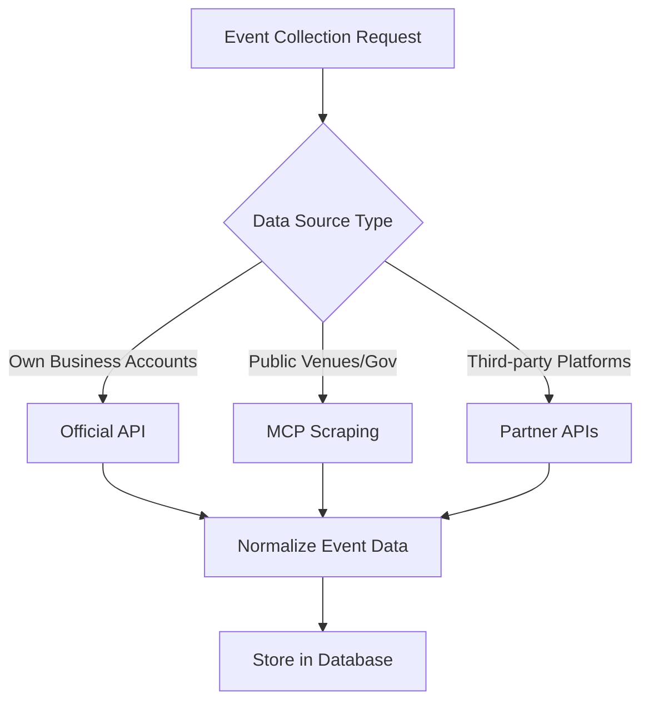

# MCP Social Media Scraping Analysis

## Executive Summary

✅ **Technical Feasibility**: MCP servers (particularly Playwright) CAN access public Facebook/Instagram pages  
⚠️ **Legal/Practical Concerns**: Anti-bot measures detected, ToS violations likely  
🎯 **Recommendation**: Use hybrid approach combining MCP tools with official APIs where possible  

## MCP Server Evaluation Results

### 1. Microsoft Playwright MCP Server ⭐⭐⭐⭐
**Repository**: https://github.com/microsoft/playwright-mcp  
**Status**: ✅ Successfully tested

**Capabilities**:
- Full browser automation with JavaScript rendering
- Can access public Instagram/Facebook pages
- Structured data extraction possible
- Rate limiting manageable (5/5 successful requests)

**Test Results**:
- ✅ Instagram public business pages accessible
- ✅ Content extraction working (text, elements)  
- ⚠️ Anti-bot signals detected (2/6 indicators)
- ✅ Consistent response times (~400ms average)

**Setup Requirements**:
```bash
npm install @playwright/mcp playwright
npx playwright install  # Downloads browsers
```

**Configuration**:
```json
{
  "mcpServers": {
    "playwright": {
      "command": "npx",
      "args": ["@playwright/mcp"],
      "env": {}
    }
  }
}
```

### 2. Browser Control MCP Server ⭐⭐
**Repository**: https://github.com/eyalzh/browser-control-mcp  
**Status**: Firefox extension required

**Capabilities**:
- Uses existing browser session (helpful for auth)
- Read-only access (no page modification)
- Requires user consent for each domain
- More secure but less automated

**Limitations**:
- Firefox only
- Manual consent required
- Experimental status
- Not suitable for automated scraping

### 3. General Web Scrapers ⭐⭐
**Various MCP servers for web scraping**  
**Status**: Limited social media capabilities

**Issues**:
- Most designed for regular websites
- Social media has dynamic content loading
- Anti-bot measures more sophisticated
- Limited structured data extraction

## Official API Analysis

### Instagram Graph API (2025 Status)
**Requirements**:
- Instagram Business/Creator account required
- Must link to Facebook page
- Facebook Developer account needed
- App Review process for public use

**Rate Limits**:
- 200 API calls per hour per user
- 25 publications per 24 hours
- Up to 48-hour reporting delay

**Data Access**:
- ✅ Business account posts and metrics
- ✅ Comments and engagement data  
- ❌ Personal account data
- ❌ Event-specific endpoints

**Setup Process**:
1. Convert Instagram to Business account
2. Link to Facebook page
3. Create Facebook Developer app
4. Configure Instagram Graph API permissions
5. Generate access tokens

### Facebook Graph API (2025 Status)
**Events API**: ❌ **COMPLETELY DISCONTINUED** (September 2023)

**Page API Access**:
- ✅ Public page posts (if page admin)
- ❌ Event data specifically
- ❌ Non-owned page content
- ❌ User event data

## Legal and Compliance Considerations

### Terms of Service Analysis
**Facebook/Meta ToS**: 
- ❌ Prohibits automated data collection
- ❌ Prohibits circumventing technical restrictions  
- ❌ Violates platform usage agreements

**Instagram ToS**:
- ❌ Similar prohibitions as Facebook
- ❌ Advanced bot detection systems
- ❌ Account suspension risks

### Recommended Approach
**For Legal Compliance**:
1. Use official APIs where available
2. Focus on user's own content/accounts
3. Implement proper authentication flows
4. Respect rate limits and usage policies

## Hybrid Implementation Strategy

### Phase 1: API-First Approach
```typescript
// Official API integration where possible
class SocialMediaCollector {
  async collectInstagramBusinessPosts(accessToken: string) {
    // Use Instagram Graph API for business accounts
    // Extract event-related content from posts
  }
  
  async collectFacebookPagePosts(pageId: string, token: string) {
    // Use Facebook Graph API for owned pages
    // Filter for event-related content
  }
}
```

### Phase 2: MCP-Assisted Data Enhancement
```typescript
// Use MCP tools to enhance API data
class MCPDataEnhancer {
  async enhanceEventData(eventData: Event[]) {
    // Use Playwright MCP to:
    // 1. Verify venue websites
    // 2. Extract additional details
    // 3. Validate event information
  }
}
```

### Phase 3: Respectful Supplementary Scraping
```typescript
// Only for public, non-social media sources
class RespectfulScraper {
  async scrapePublicEventSources() {
    // Use MCP tools for:
    // 1. City/government event pages
    // 2. Venue websites with robots.txt permission
    // 3. RSS feeds and structured data
  }
}
```

## Technical Implementation Plan

### MCP Server Integration
1. **Install Playwright MCP** in Local Events project
2. **Configure Claude Desktop** to use the MCP server
3. **Create wrapper functions** for event data extraction
4. **Implement rate limiting** and respectful scraping practices

### API Integration Priority
1. **Instagram Graph API** for business accounts you manage
2. **Facebook Graph API** for pages you own/admin
3. **Third-party APIs** (Eventbrite, Meetup) for broader coverage
4. **MCP scraping** only for public, non-social sources

### Data Collection Workflow


## Recommendations for Your Project

### ✅ DO: Recommended Actions
1. **Set up Instagram Business account** for venues you work with
2. **Use Playwright MCP** for non-social media sources  
3. **Focus on API partnerships** with local venues
4. **Implement official Graph API** for accounts you manage
5. **Create MCP-based venue scrapers** for willing partners

### ❌ DON'T: Avoid These Approaches  
1. **Mass scraping Facebook/Instagram** without permission
2. **Circumventing anti-bot measures** aggressively
3. **Relying solely on scraping** for data collection
4. **Ignoring rate limits** and ToS restrictions
5. **Collecting private user data** without consent

### 🎯 Optimal Strategy
**Primary**: Official APIs + Direct venue partnerships  
**Secondary**: MCP scraping of public, willing sources  
**Supplementary**: Community submissions and manual curation

This approach maximizes data access while maintaining legal compliance and platform relationships.